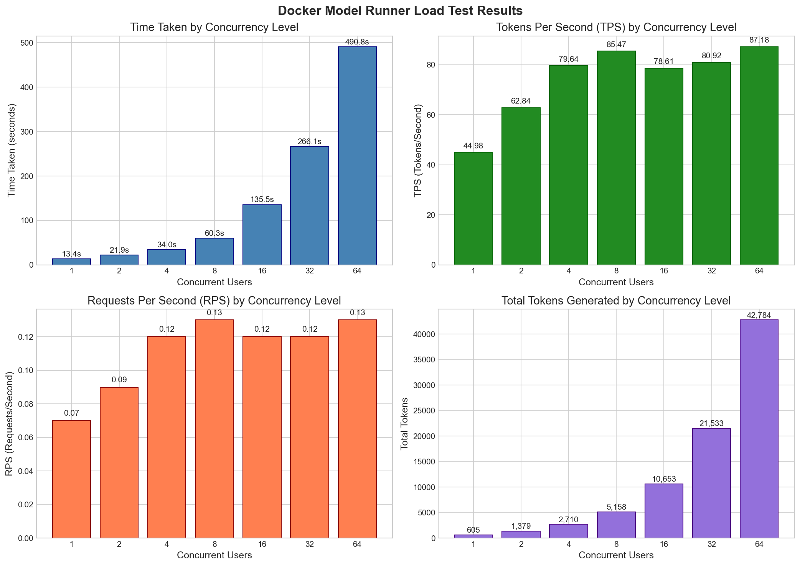
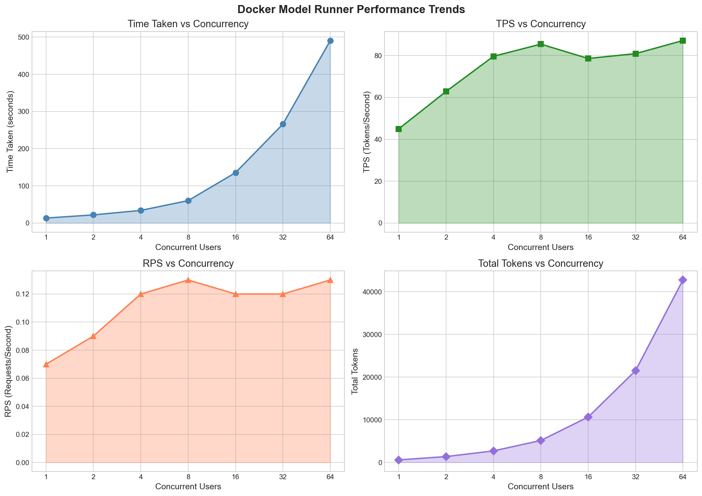

# Docker Model Runner Load Test

This repository contains load testing tools for Docker Model Runner.

## Test Results

The following charts show the performance metrics from load tests with varying concurrency levels (1, 2, 4, 8, 16, 32, 64 concurrent users).

This test used a simple essay writing prompt of 500 words (max limit is 1000 tokens) to evaluate the model's performance under load. The model used is `llama3.2` (3 billion parameters) from Docker model, which enables concurrent user call capabilities. More real world software development test can be found in [this repository](https://github.com/JerMa88/parallel_llm/tree/main/src/transformer).

Hardware specifications for the test environment:
- **CPU**: Apple M2 Pro (12-core)
- **SoC shared RAM**: 16 GB
- **GPU**: Integrated 16-core GPU
    - Core Count: 16 GPU cores in the base configuration. 
    - Memory: Shares unified memory with the CPU, with up to 200GB/s bandwidth for M2 Pro chips.
    - Media Engine: Includes dedicated hardware for H.264, HEVC, ProRes, and ProRes RAW acceleration

### Performance Metrics by Concurrency



- **Time Taken**: Total time to complete all requests at each concurrency level
- **TPS (Tokens Per Second)**: Token generation throughput
- **RPS (Requests Per Second)**: Request throughput
- **Total Tokens**: Total tokens generated across all requests

### Performance Trends



Line charts showing how each metric scales with increasing concurrency.

## Usage

### Running Load Tests

Please edit `.env` file to set the `MODEL_URL` to your Docker Model Runner endpoint before running the tests.
Also, `.env` files contains other configurations such as `prompt` `TOTAL_REQUESTS` and `MAX_TOKENS` that can be used to run different test scenarios.

```bash
./run.sh > ./log/test_single.log
```

### Analyzing Results

Open `analyze_logs.ipynb` in Jupyter to parse log files and generate the visualizations.

## Project Structure

```
├── bench-app/
│   ├── Dockerfile
│   ├── load_test.py
│   └── requirements.txt
├── docker-compose.yml
├── run.sh
├── log/                    # Test output logs
├── analyze_logs.ipynb      # Analysis notebook
└── README.md
```
